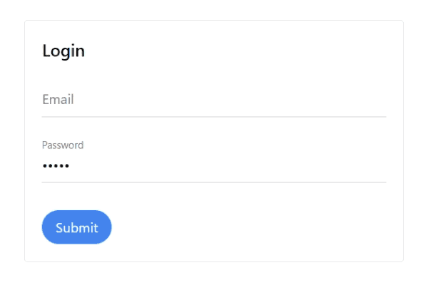

# Floating label Field with Tailwindcss

This is a react component input with floating lable style

## Usage

```
import { useState } from "react";
import Input from "./component/input";

const App = () => {
  const [email, setEmail] = useState("");

  return (
        <form className="pt-5">
            <Input
                label="Email"
                name="email"
                type="email"
                value={email}
                onChange={(v) => setEmail(v.target.value)}
            />
        </form>
  )
}

```


## Contributing

Please see [CONTRIBUTING](.github/CONTRIBUTING.md) for details.

## Security Vulnerabilities

Please review [our security policy](../../security/policy) on how to report security vulnerabilities.

## Credits

-   [k90mirzaei](https://github.com/k90mirzaei)
-   [All Contributors](../../contributors)

## License

The MIT License (MIT). Please see [License File](LICENSE.md) for more information.

## Support

This project needs a ⭐️ from you. Don't forget to leave a star ⭐️
